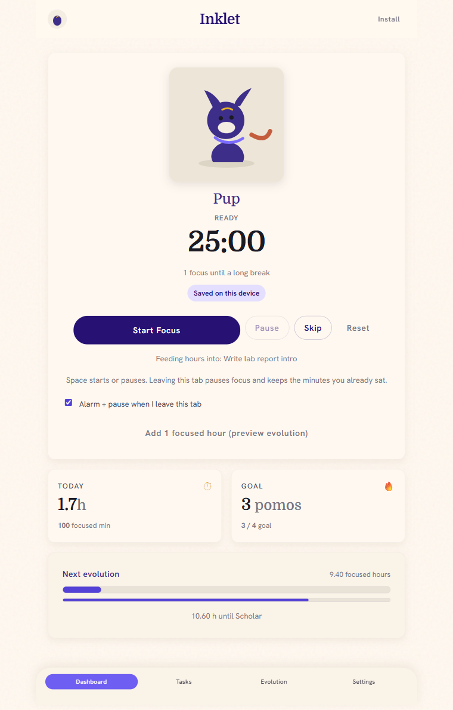
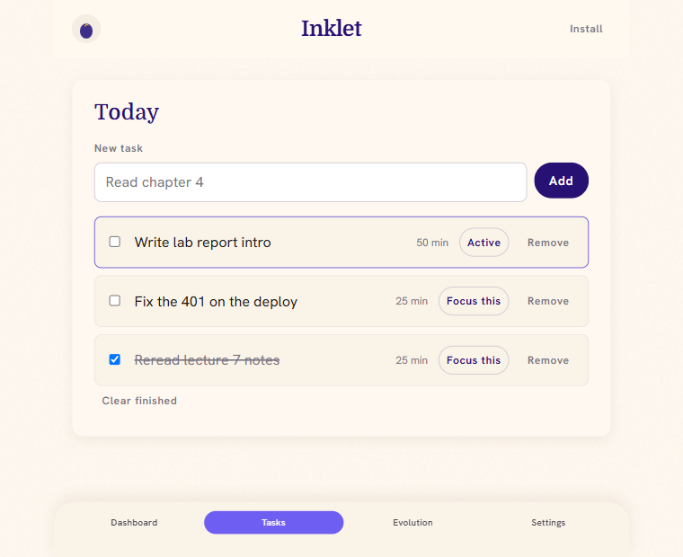
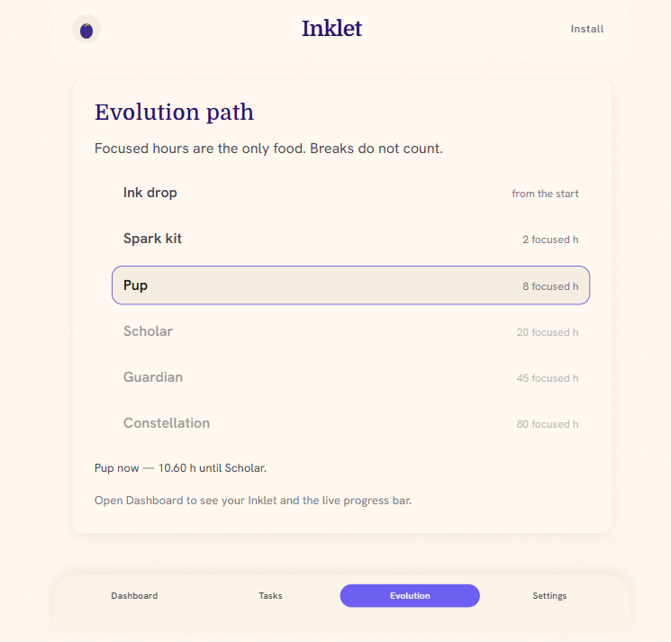
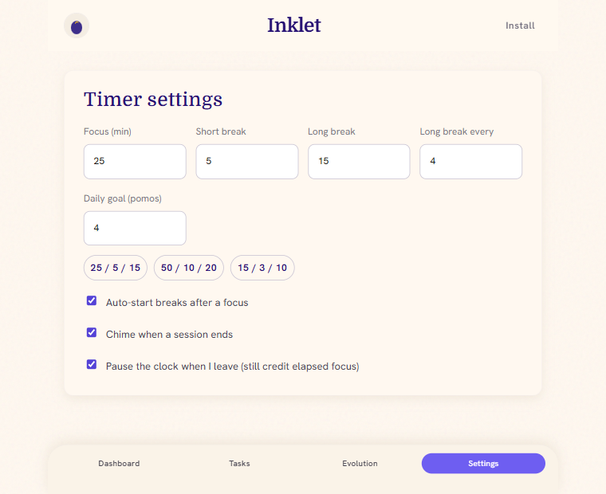

# Pom-pom

**A student Pomodoro tracker where only focused hours count.**

Your tasks stay a plain list. A small ink-creature — the **Inklet** — grows on one currency: minutes you actually sat still. Breaks do not feed it. Ticking a checkbox does not feed it. Leaving the tab pauses the clock and keeps only the minutes you really did.

**Live app → [romeo-04.github.io/pom-pom](https://romeo-04.github.io/pom-pom/)** · installable PWA · works offline · no account needed

<p align="center">
  
</p>

---

## The four tabs

The app is a single column with a bottom dock. Four tabs, four panels — that's the whole surface.

| Tab | Panel | What lives there |
| --- | --- | --- |
| **Dashboard** | `#panel-dash` | The Inklet, the clock, timer controls, today's stats, the next-evolution meter |
| **Tasks** | `#panel-tasks` | Today's list, the active task, per-task focused minutes |
| **Evolution** | `#panel-evo` | All six stages with their hour thresholds and where you currently stand |
| **Settings** | `#panel-settings` | Durations, presets, daily goal, and the three behaviour toggles |

### Dashboard

The default tab, and the only one you need during a session.

- **Pet stage** — the Inklet rendered for your current stage, with an **Evolved** flash when you cross a threshold. It swaps art by mood (`idle` / `focus` / `rest`) and falls back to an SVG placeholder when a stage image is missing.
- **Clock and phase** — `25:00`, a phase label (*Ready · Focus · Focus paused · Short break · Long break*), and a line counting focuses until your next long break.
- **Controls** — **Start Focus**, **Pause**, **Skip**, **Reset**. <kbd>Space</kbd> starts or pauses from anywhere outside a text field.
- **Active task** — *"Feeding hours into: Write lab report intro."* No task selected? The hours still count for the Inklet.
- **Tab guard checkbox** — *Alarm + pause when I leave this tab*, toggleable right where you're sitting.
- **Two stat cards** — **Today** (focused hours, switching to minutes under an hour) and **Goal** (pomodoros done, against your daily goal).
- **Next evolution card** — cumulative focused hours, a progress meter to the next stage, the daily-goal meter beneath it, and *"10.60 h until Scholar."*

There is also an **Add 1 focused hour (preview evolution)** button on this panel. It is a deliberate demo affordance — it lets you show an evolution in a live demo without studying for two hours. Delete the `debug` block at the bottom of [`src/main.js`](src/main.js) to drop it.

### Tasks



A list, on purpose. Add a task (80 characters max), check it off, remove it, or **Clear finished**.

One task at a time is **Active** — marked with an accent border and an *Active* button instead of *Focus this*. Focus minutes are credited to that task as well as to the Inklet, so each row shows its own running total (`50 min`). Adding your first task makes it active automatically; removing the active task promotes the next unfinished one.

### Evolution



The full ladder, rendered from the same `STAGES` table the timer uses — reached stages are solid, unreached ones dimmed, and your current stage is boxed. The footer line reads *"Pup now — 10.60 h until Scholar."*

| Stage | Name | Cumulative focused hours |
| --- | --- | --- |
| 0 | Ink drop | 0 |
| 1 | Spark kit | 2 |
| 2 | Pup | 8 |
| 3 | Scholar | 20 |
| 4 | Guardian | 45 |
| 5 | Constellation | 80 |

Thresholds are slow on purpose. You cannot binge-evolve in one all-nighter.

### Settings



- **Durations** — focus (1–90 min), short break (1–30), long break (1–45), long break every *n* focuses (2–12), daily goal in pomodoros (1–24).
- **Presets** — `25 / 5 / 15` (classic), `50 / 10 / 20` (long), `15 / 3 / 10` (sprint).
- **Auto-start breaks after a focus** — on by default; off leaves you idle between phases.
- **Chime when a session ends** — a three-note Web Audio arpeggio.
- **Pause the clock when I leave (still credit elapsed focus)** — the honesty rule, in one sentence.

---

## The rules that make it different

**Breaks do not count.** Only `focus` phases credit time — see `isFocusPhase` in [`src/logic/pomodoro.js`](src/logic/pomodoro.js). You cannot farm the pet from the break screen.

**Leaving is named, not punished.** Hide the tab mid-focus and the app pauses the clock, credits the minutes you actually sat, plays a two-tone alarm (with a browser notification if you granted one), and announces it to screen readers via an `aria-live` region. Come back and the alarm stops. Both halves — the alarm and the pause — can be switched off.

**Partial focus is real focus.** Pause, Reset, closing the tab, and leaving mid-session all credit elapsed time, capped at the planned duration. Quitting at minute 18 of 25 earns 18 minutes, not zero.

**Your hours stay yours.** The client keeps everything in `localStorage` under `hatch.v1` — no account, no network call, no analytics, and today's totals roll over on date change. The optional backend below is genuinely optional: nothing in `src/` calls it.

---

## Design

The UI is the **Ink & Kit** system: warm paper (`#fff8f0`) with a faint fractal-noise grain, ink-indigo primary (`#271274`), periwinkle accent (`#5442d6`), gold and rust highlights. Domine (serif) for display, Hanken Grotesk for UI. Soft cards on paper shadow, a pill-shaped floating dock, 640px max column.

Tokens live at the top of [`src/styles.css`](src/styles.css). Stage artwork is looked up as `public/pets/inklet-{stage}.png` (optionally `-focus` / `-rest` per mood); until those land, the app falls back to the SVG placeholders in `public/pets/placeholders/`. The generation brief is in [`docs/gemini-pet-assets.md`](docs/gemini-pet-assets.md).

---

## Run it

```bash
npm install
npm test      # 18 tests — evolution, tab-guard, and the hatch-core parity contract
npm run dev   # http://localhost:5173
```

This is an npm workspaces repo, so `npm install` at the root also wires `packages/hatch-core` and `server`.

The service worker and install prompt only exist in a **build**:

```bash
npm run build
npm run preview
```

Then use the browser's install / "Add to Home Screen" control. `npm run dev` deliberately does not register the production service worker.

```bash
npm run icons        # regenerate PWA icons from the source SVG
npm run dev:server   # the optional API on :8787
npm run test:server  # 85 server tests (the Postgres ones skip without DATABASE_URL)
npm run test:all     # both suites
```

---

## Stack

The app is vanilla JS, no framework. [Vite 6](https://vite.dev) + [vite-plugin-pwa](https://vite-pwa-org.netlify.app) (Workbox `generateSW`), [Vitest](https://vitest.dev) for the logic tests. Web Audio for the alarm and chime; the alarm also has a generated WAV fallback so it can sound while the tab is hidden.

```
src/                     the PWA — everything above runs from here alone
  main.js                wiring: render loop, events, tab switching
  pwa.js                 service-worker registration + install button
  styles.css             Ink & Kit tokens and components
  logic/
    pomodoro.js          phases, durations, cycle math, elapsed-time credit
    evolution.js         STAGES table, thresholds, progress, asset paths
    store.js             localStorage state, tasks, daily rollover
    tab-guard.js         leave-detection rules + alarm cooldown
    alert-sound.js       Web Audio alarm, chime, notifications

packages/hatch-core/     the shared kernel: one copy of the stage thresholds
                         and cycle math, with a parity test pinning it to src/logic/

server/                  optional Fastify API (nothing in src/ calls it yet)
  src/modules/           identity, tasks, ledger, pets, settings, sync, health
  src/repos/             swappable storage: in-memory or Postgres
  api/index.js           Vercel serverless entry
```

`src/logic/` is pure and dependency-free — no DOM, no browser globals in the hot paths — which is why it's the part under test.

---

## Deploy

Pushing to `main` runs [`.github/workflows/pages.yml`](.github/workflows/pages.yml): install → test → build with `BASE_URL=/pom-pom/` → publish `dist/` to GitHub Pages. **Tests gate the deploy** — a red suite means no publish.

---

## More

- [`docs/showcase-script.md`](docs/showcase-script.md) — the live-demo script, beat by beat
- [`docs/fe-be-task-assignment.md`](docs/fe-be-task-assignment.md) — the module contract the backend is built against
- [`docs/gemini-pet-assets.md`](docs/gemini-pet-assets.md) — Inklet art brief and stage prompts
- [`server/.env.example`](server/.env.example) — the API's environment surface
